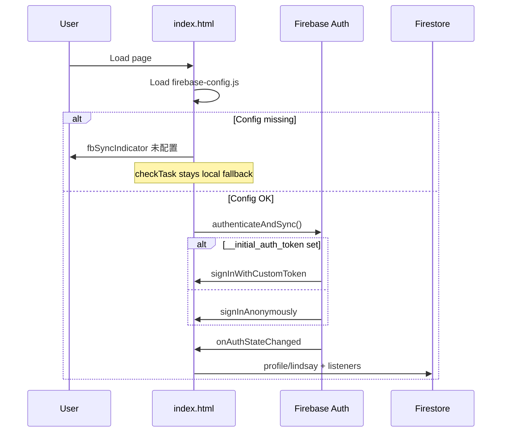

# Architecture Audit: blaze-skate-analysis

**Audit date:** 2026-06-03  
**Repository:** `blaze-skate-analysis` (npm package: `blaze-skate-analysis` v1.0.0)  
**Remote:** `https://github.com/lafa-el/blaze-skate-analysis.git`  
**Product name:** BLAZE SKATE LAB — Speed Skating Analytics System  
**Scope:** Read-only codebase analysis; application logic was not modified.

---

## 1. Project Overview

### Product

**BLAZE SKATE LAB** is a Chinese-first, mobile-friendly analytics PWA for speed skating. It targets a coach/athlete workflow centered on **Lindsay** (hard-coded persona): browser-only biomechanics (MediaPipe Pose), Junior D pacing analysis, weekly planning with points check-in, and equipment fitting records. Video is processed locally and is **not uploaded** to the cloud.

### Architecture style

| Attribute | Value |
|-----------|--------|
| Pattern | Monolithic static single-page application |
| Code organization | ~99% in one file: `index.html` (~3,570 lines) |
| Backend | Firebase BaaS (Auth + Firestore); no custom API |
| Bundler | None for app code; Vercel build only generates Firebase config |
| Tests | None |
| README | **Not present** in repository |

### Script architecture (logical layers in `index.html`)

| Block | Approx. lines | Role |
|-------|---------------|------|
| `<head>` + inline CSS | 1–~440 | Tailwind CDN config, theme tokens, layout |
| HTML body (tabs) | ~440–1085 | Four tab UIs |
| Global `<script>` | ~1086–1595 | Tabs, plans, age division, local `checkTask` fallback |
| Firebase `<script type="module">` | ~1600–1761 | Auth, Firestore sync, cloud `checkTask` |
| Biomechanics / pacing / equipment `<script>` | ~1764–3570 | MediaPipe, Chart.js, equipment CRUD |

---

## 2. Tech Stack

| Layer | Technology | Notes |
|-------|------------|--------|
| UI | HTML + vanilla JavaScript | No React/Vue |
| CSS | Tailwind CSS **CDN** + large inline `<style>` | Theme via `data-theme` / `data-theme-mode` |
| Charts | Chart.js (jsDelivr CDN) | Pacing tab; canvas fallback drawing |
| Icons / fonts | Font Awesome 6, Google Fonts Inter | CDN |
| Pose / CV | MediaPipe Pose + camera_utils + drawing_utils | jsDelivr CDN |
| Firebase | v11.6.1 ESM from `gstatic.com` | Separate from Training’s npm Firebase 12 |
| Build | Node ESM: `scripts/generate-firebase-config.mjs` | Only output: `firebase-config.js` |
| Deploy | Vercel | `vercel.json` |
| Package manager | npm | No runtime `dependencies` |
| TypeScript | No | |
| Router | None | Tab IDs in DOM + `switchTab()` |

**Not used:** React, Vite/Webpack app build, Next.js, Cloud Functions, Firebase Storage SDK, Analytics, LLM APIs, test runners, CI workflows in repo.

---

## 3. Folder Structure

```
blaze-skate-analysis/
├── docs/
│   └── architecture-audit.md       # this file
├── index.html                      # entire application (~3570 lines)
├── package.json                    # build script only
├── vercel.json                     # Vercel deploy config
├── site.webmanifest                # PWA metadata
├── firestore.rules                 # Security rules (not wired via firebase.json in repo)
├── firebase-config.sample.js       # Config template for local dev
├── scripts/
│   └── generate-firebase-config.mjs
├── assets/
│   ├── blaze-skate-lab-icon.svg
│   └── blaze-logo-preview-*.svg    # logo previews (3 variants)
└── .gitignore                      # ignores firebase-config.js, .vercel, node_modules
```

**Generated at build (gitignored):** `firebase-config.js`

**Referenced but missing from `assets/`:** `blaze-skate-lab-icon-192.png`, `blaze-skate-lab-icon-512.png` (listed in HTML manifest; only SVG committed)

**Absent:** `src/`, `README.md`, `firebase.json`, `.firebaserc`, `.github/workflows/`, `tests/`, `.env.example`.

---

## 4. Routing Structure

There is **no URL-based routing** (no hash or History API).

### Navigation model

| Mechanism | Implementation |
|-----------|----------------|
| Primary nav | Top tab buttons calling `switchTab(tabId)` |
| Active tab state | CSS class `active` on `#tab-{id}`; inactive tabs `display: none !important` |
| Default tab | `biomechanics` (`tab-biomechanics` has `active` on load) |
| Cross-tab actions | `goToPlanningAndLoad(planType)`, inline `onclick`, `switchTab('biomechanics')` from equipment |

### Tab map

| `tabId` | DOM id | Button id | Accent color |
|---------|--------|-----------|--------------|
| `biomechanics` | `#tab-biomechanics` | `#btn-biomechanics` | `skating-pro` (purple) |
| `pacing` | `#tab-pacing` | `#btn-pacing` | `skating-neon` (blue) |
| `planning` | `#tab-planning` | `#btn-planning` | `skating-pro` |
| `equipment` | `#tab-equipment` | `#btn-equipment` | `skating-accent` (orange) |

### Deep links

Not supported. Bookmarking always opens default tab unless extended manually.

---

## 5. Main Features

### 5.1 Biomechanics (`biomechanics`) — default tab

| Feature | Detail |
|---------|--------|
| Video upload | `<input type="file" accept="video/*">` → `URL.createObjectURL` local playback |
| Privacy | UI states video never uploaded |
| MediaPipe Pose | `modelComplexity: 1`, smoothed landmarks, 0.5 detection/tracking confidence |
| Processing loop | `requestAnimationFrame` throttled (~180ms); crop around COM; resize max 640px |
| Roll correction | Manual slider ±15°; gravity grid overlay |
| Support leg | `scoreSupportLeg`, `pickSupportLeg` with hysteresis; manual L/R override for keyframes |
| Live HUD | Lean angle, knee flexion, pelvis height %, ankle recovery proxy |
| Keyframes | Up to `MAX_KEYFRAME_SAMPLES = 10`; session-only array `keyframeSamples[]` |
| Playback | Scrubber, play/pause on local video |

### 5.2 Pacing (`pacing`)

| Feature | Detail |
|---------|--------|
| Distances | 500m, 777m, 1000m (Junior D) |
| Input | Per-segment split times + editable US Junior D benchmarks |
| Output | “乳酸衰减指数” (0–100 heuristic, not lab lactate) |
| Analysis | Early/late segment averages, decay %, segment jump penalties vs benchmark |
| Visualization | Chart.js line chart + canvas fallback `drawLine` |
| Narrative | Text feedback in `#paceAIDesc` (training ratio labels e.g. 60:40) |

### 5.3 Planning (`planning`)

| Feature | Detail |
|---------|--------|
| Content | Embedded `plansDatabase`: `lean`, `bounce`, `endurance` (7 days each) |
| Task IDs | e.g. `jd_tech_mon`, `jd_speed_wed`, `jd_race_sat` |
| UI | Focus buttons → `generatePlan(type)` → 7-day card grid |
| Check-in | `checkTask(btn, taskId, points)` → Firestore transaction or local fallback |
| Points UI | Header `#globalPoints`; weekly focus points in `#pointsSummaryBox` |
| Cross-link | Biomechanics can call `goToPlanningAndLoad('bounce')` |

### 5.4 Equipment (`equipment`)

| Feature | Detail |
|---------|--------|
| Symptom templates | `slide`, `bootout`, `unstable`, `ankle`, `release`, `asymmetry` |
| Measurements | Height, weight, blade length, rocker tick readings L/R, offset quadrants, bend F/M/R |
| Rule engine | `buildEquipmentRuleHints`, `analyzeRockerSide`, etc. |
| Report | In-page “equip report” with action cards (not PDF export) |
| History | Up to 30 records; cloud via Firestore or `localStorage` fallback |
| Compare | A/B select two historical records (numeric deltas) |
| Cross-link | Button to `switchTab('biomechanics')` for posture re-check |

### 5.5 Global / header

| Feature | Detail |
|---------|--------|
| Athlete persona | Lindsay avatar, `#lindsayAgeBadge` (US speedskating division from `birthDate`) |
| Theme | `auto` / `light` / `dark` (`blaze-theme-mode`, time-based auto) |
| Firebase status | `#fbSyncIndicator` (已连接 / 未配置) |
| Points | `#globalPoints` synced from Firestore profile |

### 5.6 Not present

- User registration UI (only anonymous + optional custom token)
- Multi-athlete selector
- PDF/export reports
- Cloud video storage
- Generative AI / AI Coach

---

## 6. Firebase Usage

### Products

| Product | Used | Notes |
|---------|------|-------|
| Firebase App | Yes | `initializeApp` in ES module block |
| Authentication | Yes | Anonymous + optional custom token |
| Cloud Firestore | Yes | Profile, completedTasks, equipmentRecords |
| Cloud Storage | No | Not imported |
| Offline persistence | No | `enableIndexedDbPersistence` not called |
| Cloud Functions | No | — |

### Configuration

| Source | When |
|--------|------|
| `window.__BLAZE_FIREBASE_CONFIG__` | From `./firebase-config.js` (Vercel build) |
| `__firebase_config` (JSON string) | Embedded/sandbox override |
| `__app_id` | Override default app namespace |
| `__initial_auth_token` | Custom auth for embedded hosts |

**Build script:** `npm run build` → `scripts/generate-firebase-config.mjs` reads `VITE_FIREBASE_*`.

**Sample for local dev:** `firebase-config.sample.js` (committed).

### Logical app namespace

```javascript
const appId = typeof __app_id !== 'undefined' ? __app_id : 'blaze-skate-academy';
```

### Firestore paths (under `artifacts/{appId}/users/{uid}/`)

| Path | Type | Purpose |
|------|------|---------|
| `profile/lindsay` | Fixed document id | Athlete name, birthDate, points, lastActive |
| `completedTasks/{taskId}` | Subcollection | Planning check-ins |
| `equipmentRecords/{autoId}` | Subcollection | Equipment snapshots |

### Client operations

| Operation | API | Usage |
|-----------|-----|--------|
| Profile read/write | `getDoc`, `setDoc`, `onSnapshot` | Lindsay profile |
| Task check-in | `runTransaction` | Idempotent task doc + `increment` on profile points |
| Equipment save | `addDoc` + `serverTimestamp()` field `savedAt` | |
| Equipment list | `onSnapshot(query(..., orderBy('createdAt', 'desc')))` | **Mismatch:** writes use `savedAt`, not `createdAt` |
| Equipment delete | `deleteDoc` | Via `window.blazeEquipmentCloud.deleteRecord` |

### Security rules (in repo)

```text
artifacts/{appId}/users/{userId}/{document=**}
  allow read, write: if request.auth != null && request.auth.uid == userId
```

No `firebase.json` in repo to deploy rules via CLI.

---

## 7. Authentication Flow



| Step | Behavior |
|------|----------|
| Startup | Firebase module calls `authenticateAndSync()` immediately |
| Default | `signInAnonymously()` |
| Embedded / coach | `signInWithCustomToken(__initial_auth_token)` when global defined |
| No email/password UI | Unlike Training app |
| User id | `userId = user.uid` for all Firestore paths |
| Degraded mode | If config missing, `window.checkTask` remains local-only (defined earlier in global script) |

---

## 8. Firestore Collections / Data Models

Firestore uses the **artifacts** pattern (not top-level collection names in client code).

### Document: `profile/lindsay`

| Field | Type | Description |
|-------|------|-------------|
| `name` | string | Default `"Lindsay"` on create |
| `birthDate` | string | Default from `window.lindsayBirthDate` (`'2015-01-14'`) |
| `points` | number | Gamification balance (transaction increments) |
| `lastActive` | string | ISO timestamp on check-in |

### Subcollection: `completedTasks/{taskId}`

| Field | Type | Description |
|-------|------|-------------|
| `taskId` | string | Document id matches task id (e.g. `jd_tech_mon`) |
| `points` | number | Points awarded for that day |
| `completedAt` | timestamp | `serverTimestamp()` |

**Idempotency:** Transaction aborts if task document already exists.

### Subcollection: `equipmentRecords/{autoId}`

Client object spread into Firestore plus `savedAt: serverTimestamp()`.

| Field (representative) | Type |
|------------------------|------|
| `athlete` | string (`'Lindsay'`) |
| `discipline` | string |
| `focus` | string |
| `symptomKey` | string |
| `symptomText` | string |
| `height`, `weight`, `bladeLength` | string/number from form |
| `leftRockerReadings`, `rightRockerReadings` | number[] |
| `rockerSummary`, `offsetSummary`, `bendSummary` | string |
| `offsets` | object (leftFront, leftRear, rightFront, rightRear) |
| `bend` | object (front, middle, rear) |
| `ruleHints` | string[] |
| `adjustmentType`, `feedbackRating`, `adjustmentNotes` | string/number |
| `missingCore` | boolean |
| `savedAt` | timestamp |
| `id`, `createdAt` | Set locally in `normalizeEquipmentRecord` for UI sort |

### Embedded content (not in Firestore)

| Constant | Location | Content |
|----------|----------|---------|
| `plansDatabase` | Global script ~L1467–1507 | Junior D weekly plans (3 focuses × 7 days) |
| `symptomAdvice` | Equipment script ~L3468 | Template-specific copy |
| Pacing benchmark defaults | Pacing script | Per-distance segment labels/defaults |

### In-memory / session models

| Variable | Purpose |
|----------|---------|
| `keyframeSamples[]` | Biomechanics keyframes (not persisted) |
| `window.globalPointsVal` | Points cache |
| `window.completedTaskIds` | Task ids from Firestore or local check-in |
| `window.currentActiveFocus` | Active plan type (`lean` \| `bounce` \| `endurance`) |
| `equipmentHistoryRecords` | Local mirror of equipment list |

### athleteId

**Not implemented.** Athlete is implicit via fixed profile doc id `lindsay` and `athlete: 'Lindsay'` on equipment records.

---

## 9. Storage Usage

| Storage type | Used | Details |
|--------------|------|---------|
| Firebase Cloud Storage | **No** | Bucket may exist in config; SDK unused |
| Firestore | **Yes** | Profile, tasks, equipment |
| `localStorage` | **Yes** | `blaze-theme-mode`; `blaze-equipment-history-v1` (max 30, fallback) |
| Video blobs | **Local only** | `URL.createObjectURL`; revoked on reset |
| IndexedDB | **No** | No Firestore offline persistence enabled |
| Cookies | No explicit usage | — |

---

## 10. Environment Variables

Used **only at build time** by `generate-firebase-config.mjs`:

| Variable | Purpose |
|----------|---------|
| `VITE_FIREBASE_API_KEY` | Firebase web API key |
| `VITE_FIREBASE_AUTH_DOMAIN` | Auth domain |
| `VITE_FIREBASE_PROJECT_ID` | GCP project id |
| `VITE_FIREBASE_STORAGE_BUCKET` | Storage bucket (unused by app) |
| `VITE_FIREBASE_MESSAGING_SENDER_ID` | Sender id |
| `VITE_FIREBASE_APP_ID` | Firebase app id |

| Finding | Detail |
|---------|--------|
| `.env` in repo | None |
| Runtime `import.meta.env` | N/A (no Vite app bundle) |
| Missing vars | Build warns but still writes empty strings to `firebase-config.js` |
| Production values | Not in repository (configured in Vercel dashboard) |

### Sandbox globals (runtime, optional)

| Global | Purpose |
|--------|---------|
| `__firebase_config` | JSON string override |
| `__app_id` | Firestore namespace override |
| `__initial_auth_token` | Custom auth token |

---

## 11. Deployment Setup

### Vercel (`vercel.json`)

| Setting | Value |
|---------|--------|
| `buildCommand` | `npm run build` |
| `outputDirectory` | `.` (repo root static) |
| `cleanUrls` | `true` |

### Flow

1. Vercel runs `node scripts/generate-firebase-config.mjs`.
2. Writes `firebase-config.js` (gitignored).
3. Serves `index.html`, `assets/`, generated config as static files.

### Not in repository

| Item | Status |
|------|--------|
| GitHub Actions CI | Absent |
| Firebase Hosting | Absent |
| Preview/staging docs | Absent |
| `firebase deploy` wiring | Absent |

### PWA

- `site.webmanifest`: standalone, theme `#0f172a`
- Icons reference PNG paths that may 404 if PNGs not deployed separately

---

## 12. Important Components

There are **no separate component files**. UI is HTML sections + functions that manipulate the DOM.

### Tab panels (HTML `<main>`)

| Element | Role |
|---------|------|
| `#tab-biomechanics` | Video lab, canvas overlay, keyframe list |
| `#tab-pacing` | Split inputs, chart, lactic index cards |
| `#tab-planning` | Focus selector, `#calendarGrid`, points summary |
| `#tab-equipment` | Forms, report panel, history, A/B compare |

### Logical “components” (functions / globals)

| Name | Type | Responsibility |
|------|------|----------------|
| `switchTab` | function | Tab visibility and button styles |
| `goToPlanningAndLoad` | function | Cross-tab navigation + plan load |
| `generatePlan` | function | Render 7-day cards from `plansDatabase` |
| `window.checkTask` | async function | Local fallback → overridden by Firebase module |
| `window.blazeEquipmentCloud` | object | `saveRecord`, `deleteRecord` (when Firebase ready) |
| `window.setEquipmentHistory` | function | Render history from cloud/local |
| `resetUpload` | function | Clear biomechanics session state |
| `onResults` | function | MediaPipe pose callback (biomechanics block) |
| `initPoseModel` | function | Load/warm up Pose model |
| Pacing chart helpers | functions | `getBenchmarkInputs`, `updatePacingChart`, lactic index calc |
| Theme helpers | `applyThemeMode`, `cycleThemeMode` | Light/dark/auto |

### Header chrome

- Brand logo, Lindsay card, `#globalPoints`, theme toggle, `#fbSyncIndicator`

---

## 13. Important Hooks / Utilities

### React hooks

**None** — not a React application.

### Global state (`window.*`)

| Global | Purpose |
|--------|---------|
| `globalPointsVal` | Points display cache |
| `completedTaskIds` | Completed planning task ids |
| `currentActiveFocus` | Selected plan focus |
| `lindsayBirthDate` | `'2015-01-14'` |
| `supportLegTracker` | Hysteresis for support leg side |
| `switchTab`, `generatePlan`, `checkTask`, etc. | Exposed for inline handlers |

### Domain utilities (functions)

| Function | Module area | Purpose |
|----------|-------------|---------|
| `calculateSkatingAge` | Global | US season year from birth date |
| `getUSSpeedskatingDivision` | Global | Label e.g. Junior D |
| `updateSkatingAgeBadge` | Global | Header badge text |
| `calculateAngle` | Global | Joint angle for biomechanics |
| `scoreSupportLeg` / `pickSupportLeg` | Global | Support leg heuristic |
| `formatTime` | Global | `MM:SS` from seconds (video UI) |
| `buildEquipmentRuleHints` | Equipment | Rule-based hint list |
| `normalizeEquipmentRecord` | Equipment | Id + `createdAt` for UI |
| `escapeHtml` | Equipment | XSS-safe rendering |
| `loadLocalEquipmentHistory` / `saveLocalEquipmentHistory` | Equipment | localStorage fallback |

### Biomechanics-only state (script block)

| Symbol | Purpose |
|--------|---------|
| `poseModel`, `isModelReady` | MediaPipe instance |
| `keyframeSamples` | Session keyframes |
| `tiltCorrectionAngle` | Camera roll correction |
| `bioFrameLoopRunning` | rAF loop guard |

---

## 14. External Dependencies

### npm (`package.json`)

| Package | Role |
|---------|------|
| *(none)* | No `dependencies` or `devDependencies` |

Build uses Node built-in `fs` only in `generate-firebase-config.mjs`.

### CDN (runtime)

| URL / package | Role |
|---------------|------|
| `cdn.tailwindcss.com` | Tailwind JIT |
| `cdn.jsdelivr.net/npm/chart.js` | Charts |
| `cdnjs.cloudflare.com/.../font-awesome` | Icons |
| `fonts.googleapis.com` (Inter) | Typography |
| `@mediapipe/camera_utils`, `drawing_utils`, `pose` | Pose estimation |
| `www.gstatic.com/firebasejs/11.6.1/*` | Firebase App, Auth, Firestore |

### Cross-repo dependencies

| Repo | Dependency |
|------|------------|
| `blaze-skate-training` | **None** (no imports or shared packages) |
| `skatingx-platform` | **None** |

**Conceptual overlap:** Same BLAZE brand, similar `artifacts/{appId}/users/{uid}` Firestore layout, overlapping domains (500m/777m/1000m, points, Junior D plans vs Training academy) — **data not shared** without migration.

---

## 15. Current Strengths

| Strength | Why it matters |
|----------|----------------|
| **Privacy-first video analysis** | MediaPipe runs in-browser; no video upload |
| **Rich domain logic in one deployable** | Biomechanics, pacing math, plans, equipment rules ship together |
| **Firestore rules in repo** | Documented per-user isolation pattern |
| **Env-based Firebase config** | Production secrets not hardcoded (unlike Training) |
| **Transactional check-ins** | Prevents duplicate task points; atomic profile increment |
| **Degraded offline behavior** | Local `checkTask` + equipment localStorage when Firebase absent |
| **Coach-oriented UX** | Lindsay persona, US division badge, cross-tab workflows |
| **Light/dark theme** | Auto by time + manual cycle |
| **Vercel-ready pipeline** | Simple build → static deploy |

---

## 16. Technical Risks

| Risk | Severity | Detail |
|------|----------|--------|
| **Monolithic `index.html`** | High | ~3,570 lines; hard to test and merge |
| **CDN-only stack** | High | No lockfile for runtime deps; CDN outage breaks app |
| **Firebase SDK 11 vs Training 12** | High | Unified platform must align versions |
| **Equipment `orderBy('createdAt')` vs `savedAt` write** | Medium | Cloud history sort may be wrong |
| **Hard-coded Lindsay** | Medium | Blocks multi-athlete SkatingX model |
| **No automated tests** | Medium | Heuristic scoring regressions undetected |
| **No TypeScript** | Medium | Implicit Firestore shapes |
| **No offline Firestore** | Medium | Rink-side sync weaker than Training app |
| **Missing PNG PWA icons** | Low | Manifest/HTML reference files not in repo |
| **No README / architecture docs until now** | Low | Onboarding friction |
| **Global `window` pollution** | Low | Name collisions if scripts combined carelessly |
| **No URL routing** | Low | No shareable deep links to tabs |

---

## 17. Refactoring Opportunities

| Priority | Opportunity | Target outcome |
|----------|-------------|----------------|
| P0 | Vite + React (or vanilla ESM modules) split | `features/biomechanics`, `pacing`, `planning`, `equipment` |
| P0 | Fix equipment query: set `createdAt` on write or order by `savedAt` | Correct cloud history |
| P0 | npm-pin MediaPipe + Chart.js + Firebase 12 | Reproducible builds |
| P1 | Introduce `athleteId` + configurable profile path | SkatingX schema alignment |
| P1 | Persist `analysisSession` + tags (not keyframes by default) | Platform AI Coach input |
| P1 | Extract `plansDatabase` to `packages/content` | Dedupe with Training `BLAZE_ACADEMY` editorially |
| P1 | Extract skating-age utilities to `packages/skating-domain` | Share with Training |
| P2 | Add Firestore offline persistence | Parity with Training |
| P2 | `firebase.json` + deploy rules in CI | Versioned security |
| P2 | Vitest for pacing index, support-leg scoring | Safe refactors |
| P3 | Add missing PNG assets or fix manifest | PWA install quality |
| P3 | README + link to `docs/architecture-audit.md` | Contributor docs |

---

## 18. Future Merge Considerations

References: `skatingx-platform/docs/MERGE_READINESS_AUDIT_SKATINGX.md`, `SKATINGX_ARCHITECTURE_BLUEPRINT.md`, `SKATINGX_OPEN_DECISIONS.md`, `blaze-skate-training/docs/architecture-audit.md`.

### Alignment summary

| Topic | blaze-skate-analysis today | SkatingX target |
|-------|---------------------------|-----------------|
| Code home | `index.html` monolith | `skatingx-platform/apps/web/src/features/analysis/*` |
| `appId` | `blaze-skate-academy` | `skatingx-production` |
| Firebase project | Vercel env (unknown id in repo) | Single project (DR-001) |
| Profile | `profile/lindsay` | `athletes/lindsay/profile/main` |
| Points | `profile/lindsay.points` + transactions | `gamification/main` per athlete |
| Training tasks | `completedTasks` subcollection | `planning/completedTasks` under athlete |
| Video / ML | MediaPipe browser | Lazy route `/analysis/biomechanics` |
| AI Coach | None | L1 tags + L2 LLM (new) |

### Analysis → platform feature map

| Current tab | SkatingX route (proposed) |
|-------------|---------------------------|
| Biomechanics | `/analysis/biomechanics` |
| Pacing | `/analysis/pacing` |
| Planning | `/training/plan` or `/analysis/planning` |
| Equipment | `/analysis/equipment` |
| *(new)* | `/analysis/sessions` — persist summary + tags |

### Data migration touchpoints

1. Export `artifacts/blaze-skate-academy/users/*/profile/lindsay`, `completedTasks/*`, `equipmentRecords/*`.
2. Map to `athletes/lindsay/...` under `skatingx-production` (see blueprint §8).
3. **Points:** Do not auto-add Training `profile/main.points` (DR-004).
4. Normalize equipment docs: ensure `createdAt` for queries.
5. `blaze-theme-mode` → `skatingx_theme_mode`; equipment local history → cloud or drop after migrate.

### Code migration touchpoints

1. Port MediaPipe loop to isolated chunk (large bundle).
2. Replace `window.checkTask` with repository using same transaction semantics.
3. Replace CDN Firebase 11 with npm Firebase 12 from `packages/firebase-client`.
4. Keep `signInWithCustomToken` for embedded coach scenarios.
5. Emit `analysisTag[]` from pacing/biomechanics/equipment rules (blueprint §5).

### Recommended merge order (relative to Training)

| Order | Action | Rationale |
|-------|--------|-----------|
| 1 | Platform shell + schema + rules | Same as blueprint M0–M2 |
| 2 | Migrate Training first | Establishes `settings`, `athleteId`, default athlete |
| 3 | Migrate Analysis features | Depends on athlete paths; MediaPipe heaviest |
| 4 | Unify points + planning under `athletes/lindsay` | DR-003, DR-004 |
| 5 | Wire analysis tags → dashboard + AI Coach | M9–M10 |

### Risks specific to merging this repo

| Risk | Mitigation |
|------|------------|
| Largest CDN + ML bundle | Code-split `/analysis/biomechanics` only |
| Different Firebase SDK delivery | Single npm SDK in monorepo |
| Lindsay-only assumptions | Parameterize `athleteId`; use `activeAthleteId` from settings |
| Duplicate curriculum with Training | Consolidate `plansDatabase` + `BLAZE_ACADEMY` in `packages/content` |
| Local-only pacing/biomechanics results | Add `analysis/sessions/{id}/summary` persistence |

---

## Appendix A: Key file reference

| File | Lines (approx.) | Role |
|------|-----------------|------|
| `index.html` | 3570 | Full application |
| `scripts/generate-firebase-config.mjs` | 33 | Build-time config |
| `firestore.rules` | 9 | Security rules |
| `vercel.json` | 5 | Deploy |
| `package.json` | 9 | npm metadata |

## Appendix B: `plansDatabase` focus types

| Key | Title (zh) | Task id prefix |
|-----|------------|----------------|
| `lean` | 技术基础与弯道控制 | `jd_tech_*` |
| `bounce` | 速度窗口与500m配速 | `jd_speed_*` |
| `endurance` | 比赛周与恢复管理 | `jd_race_*` |

## Appendix C: Equipment symptom keys

| `symptomKey` | Focus theme |
|--------------|-------------|
| `slide` | 咬冰/弯道抓地 |
| `bootout` | Boot out / 鞋帮蹭冰 |
| `unstable` | 直道稳定性 |
| `ankle` | 脚踝负荷 |
| `release` | 出弯释放 |
| `asymmetry` | 左右脚一致性 |

---

*Generated by static analysis of `blaze-skate-analysis`. No application source files were modified.*
